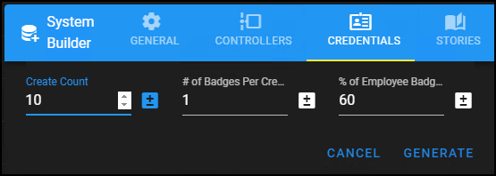

# Start this way to add extra events

1. On the system tab, open the builder, but switch to the credentials tab.
2. Lower the number of credentials. I chose 10. This makes adjusting access levels much easier.
>   
3. Now choose to generate the system and it will have 10 controllers, 10 stories of each template, and ten random credential holders. 

!!! success "Controlled demo systems"
    When making a demo that needs actors to play a part, a smaller system is easier to control. This might be a good configuration to save as and export, for a demo scenario. 

