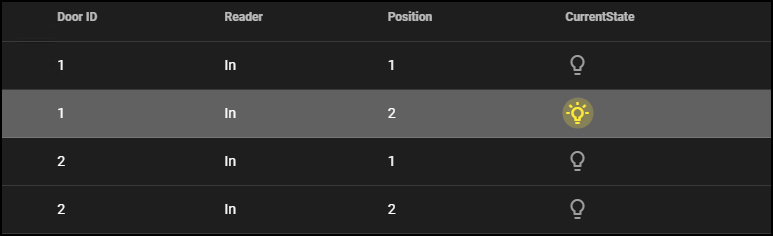

# Start this way to build a small demo system

1. On the system tab, open the builder, but switch to the credentials tab.
2. Lower the number of credentials. I chose 10. This makes adjusting access levels much easier.
>   
3. If you want to create a system with one controller and multiple doors, this is also a chance to adjust the controller to door ratio.
>   
4. Now choose to generate the system and it will have 1 controller (8 doors), 10 stories, and 10 random credential holders. 

!!! success "Custom demo systems"
    When making a demo that needs actors to play a part, a smaller system is easier to control. This might be a good configuration to save and export for future use. 

    {width=50%}

## Send predictable batches of events

Each template in the activities menu contains a pre-created list of stories, using randomly generated sets of cardholders, badges, doors and controllers. If you click the Run button on either the Activities tab or the Events tab, it will run all of these stories within each template. This could generate hundreds of events. There are over 200 stories in the list in the image below.

If you want to send a small batch of events, it is recommended to not use the Generate button, since this will create additional randomly created sets of stories on top of the list of stories already contained within each template. Also, it might be easier to delete the configuration and build a new system if you generate too many stories. It is easy to get into a situation where there are seemingly random sets of stories generating random sets of events.

## Write your stories

It is entirely possible to send a batch of events that will fill up the event list in the Smart Client and allow you to tell a story about the actions depicted. 

Generate your own set of templates and stories, but turn off the randomize feature, and choose specific doors.

Run the events, and check the Smart Client. 

## Demonstrate Inputs and Outputs in the Smart Client

The inputs and outputs functionality built into the XPA Simulator works best as a manual demonstration. Here is the easiest way to set it up.
***
1. Create a map in the Smart Client.
2. Put the inputs and output icons from a door on the map.
3. Trigger inputs from the Inputs tab of the XPA Simulator.
>   
>
>   + Switch to the Smart Client to verify!
>
>   
4. Trigger outputs from the output icons shortcut menu in the Smart Client map.
>   
>
>   + Switch to the XPA Simulator to verify!
>
>   
