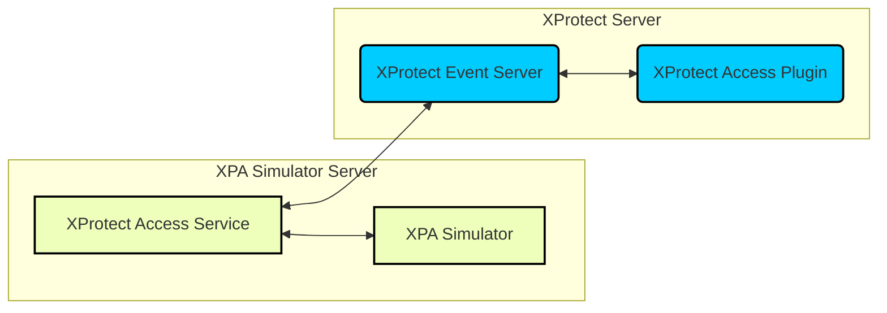

# Solution Overview

The XPA Simulator software should be installed on a server in the same local network as the XProtect server. It doesn't require an installed and operational access control system, however it does require the same XProtect Access integration components installed that would enable connection between XProtect and a third party system.

## General description

This document **describes the XProtect Access simulator and the integration** between Milestone XProtect video management system (VMS) and the simulated access control (AC) system. This integration supports all of the [standard XProtect Access features.](https://doc.milestonesys.com/latest/en-US/add-ons/add-on_access/access_xpraccessexplained.htm?tocpath=Add-ons%7CXProtect%20Access%7COverview%7C_____1)

In addition to the standard XProtect Access features, the simulator can be used to quickly **build and demonstrate systems of any size**, and it can be used to **send batches of events** to the XProtect Access system for the purpose of **feature testing and performance testing**.