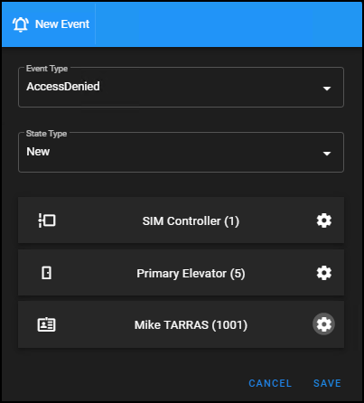
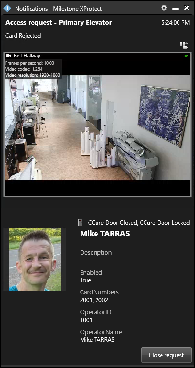
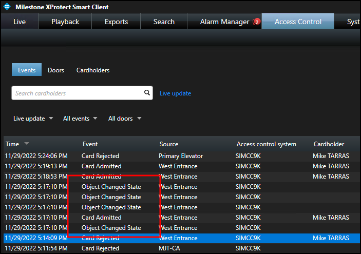
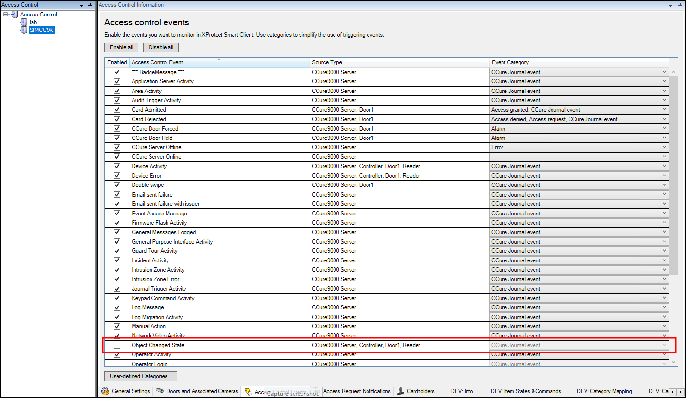

# Choose a size for the Simulator

Before working with the XPA Simulator if is required to add controllers,  cardholders, and stories.

+ Click the **Builder** button on the **Home** tab of the web user interface.
+ The System Builder dialog window will pop-up offering a choice between several sizes of simulated access control systems: 
    
| System Size   | Doors | Credentials   | Stories   |
|---------------|-------|---------------|-----------|
| Small         | 10    | 100           | 10        |
| Medium        | 100   | 1000          | 100       |
| Large         | 1000  | 10,000        | 50        |
| XL            | 2000  | 50,000        | 100       |
| XXL           | 3000  | 100,000       | 500       |
| XXXL          | 5000  | 400,000       | 1000      |

+ Choose any size system, click **Generate**, and wait for the simulator application to apply the configuration. 

## Set up a demo event

The most flexible way to send a single specific event into XProtect using the current state of the XPA Simulator is with the following procedure.

1. Go to the **Events** tab.
2. Click **New**.
3. Choose the **Event Type**, **State Type**, the controller, door and credentials.
>   
4. **Save** the event.
5. Verify the event in XProtect.
>   
6. It is also possible to manually use the Operations tab to swipe cards and generate door held events. However, it is not yet possible to generate all types of events using the Operations tab. Read more at XPA Simulator web user interface (Live).

## Run a batch of events

1. Go to the **Activities** tab of the XPA Simulator.
2. Click the **Run** button to generate all of the stories contained within each template.

!!! tip "Customizing batch events"
    You can send batches of events using the **Activities** tab. However, the initial setup for this configuration requires additional customization of the **Access Control Events** tab in the XPA instance of the Management Client. For example - the CCure integration creates many additional **Object Changed State** events by default for each story that the XPA Simulator creates.

    
    
    If you would prefer to have a demo that is more user friendly, it is recommended to disable any events you don't want to see in the XPA integration.

    
