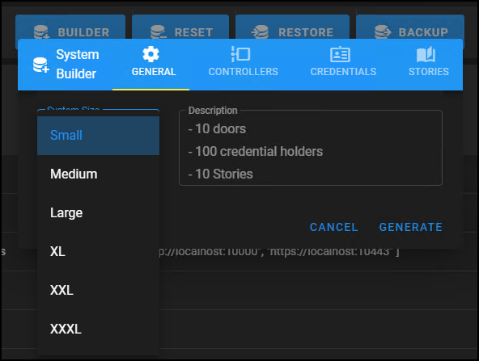

# Choose a size for the Simulator

Before working with the XPA Simulator if is required to add controllers,  cardholders, and stories.

+ Click the **Builder** button on the **Home** tab of the web user interface.
+ The System Builder dialog window will pop-up offering a choice between several sizes of simulated access control systems: 
    
| System Size   | Doors | Credentials   | Stories   |
|---------------|-------|---------------|-----------|
| Small         | 10    | 100           | 10        |
| Medium        | 100   | 1000          | 100       |
| Large         | 1000  | 10,000        | 50        |
| XL            | 2000  | 50,000        | 100       |
| XXL           | 3000  | 100,000       | 500       |
| XXXL          | 5000  | 400,000       | 1000      |

+ Choose any size system, click **Generate**, and wait for the simulator application to apply the configuration. 

## Customizing users, events, stories...