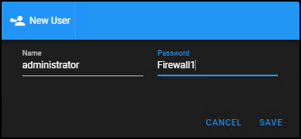
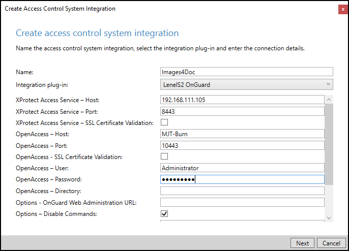

# Connection requirements

There are two things required to connect the XPA Simulator with an XProtect VMS system.

1. Create a user in the XPA Simulator.
2. Create the XPA instance in the Management Client. 

## Creating a user

The first thing to do when you launch the web user interface of the XPA Simulator is create the user you will need to use to establish the connection to XProtect. 

1. Go to the **Users** tab of the web user interface.
2. Click **New**.
3. In the **New User** dialog window, enter a username and password that will be used to connect to XProtect.  
     
     
    

!!! success "What users should I create?"
    It is recommended to create a user account with administrative privileges on the XProtect system. 

## Creating the XProtect Access instance

Connecting to the XPA Simulator with XProtect uses the same process as connecting to any third party AC system. 

1. Go to the Management Client on your XProtect system, right-click the root node in your access control menu, and choose **Create new...** from the short cut menu.
2. Name the connection and choose the plug-in from those installed.
3. Fill out the required properties for either the OnGuard or the CCure plug-ins, and click **Next** to create the connection.

## Connection parameters for OnGuard and CCure

Connecting to the XPA Simulator with XProtect uses the same process as connecting to any third party AC system. Before establishing the connection review the following parameters and document them to make sure the connection attempt is successful.

These parameters are different based on the XProtect Access service and XProtect Access MIP Plug-in software components installed.

**OnGuard**

| Required Data | Description and location  |
|---------------|---------------------------|
| XProtect Access Service - Host:   | IP address of XPA Simulator host server.  |
| XProtect Access Service - Port:   | 8443  |
| OpenAccess - Host | PC/DNS name of the XPA simulator host server  |
| OpenAccess - Port | 10443  |
| OpenAccess - User:    | Administrator  |
| OpenAccess - Password:    | Firewall1  |

**CCure**

| Required Data | Description and location  |
|---------------|---------------------------|
| XProtect Access Service - Host:   | IP address of XPA Simulator host server.  |
| XProtect Access Service - Port:   | 8443  |
| Victor Web Service - Host | PC/DNS name of the XPA simulator host server  |
| Victor Web Service - Port | 10443  |
| Victor Web Service - Use HTTPS:   | Populate this check box to use https.  |
| Victor Web Service - User:    | Administrator  |
| Victor Web Service - Password:    | Firewall1  |

!!! warning "OpenAccess & Victor Web Service Users"
    The OpenAccess and Victor Web Service User and Password fields for both OnGuard and CCure should be filled with the user and password that was created [[above](../Start/index.md#creating-a-user).
