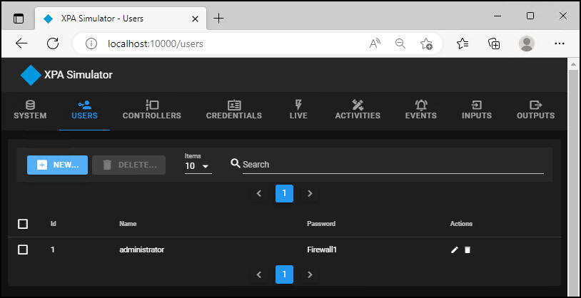

# Tour the XPA Simulator UI

## There are several tabs we can choose from:

***
> 
> Below the interface images, are descriptions of all the available functions each tab offers. Check here for more info about feature and performance testing and demonstration.
> 
***

=== "System"
    
        
    1. Opening the web UI for the XPA Simulator presents the **Home** tab.
    2. Click the **Builder** button to choose the size of the system.
    3. The **Reset** button will remove any configuration that has been applied to the XPA Simulator.
    4. The **Properties** window shows all of the properties of the XPA Simulator, which are described [here](../Ref/index.md).

=== "Users"
    
     
    + This tab must be used before connecting to XProtect to [create the user account](../Start/index.md#creating-a-user) that establishes the connection.

=== "Controllers"
    
    
    + Select the Controllers tab.
    + Click the Generate... button to open the Generate Controllers dialog.
    
    
    
    + Define the number of controllers to generate, the number of doors each controller will have, and the percentage of doors which will have dual readers (other doors will only have one reader). Choose a prefix name for each controller and door. Each controller and door created will bear the prefix, along with a unique subsequently assigned numerical suffix
    + Click **Generate** to add the controllers and doors to the XPA Simulator.
    + Click the **New** button on the **Controllers** tab to open the **New Controller** dialog.
    + Enter a name for the controller and click **Save**.
    + From the list of controllers, click the pencil icon to edit the name of the controller.
    + Click the garbage can icon to delete the controller and confirm if you want to delete the controller and all of its connected doors and readers.
    + Find any controller using the navigation tools built into the page, or search for your controller.
    + Click the down arrow icon to expand the controller configuration menu.
    
    

    + Click the Generate... button to open the Generate Doors dialog.

    
    
    + Choose the number of doors to create, define a door prefix, and set the percentage of doors which will have dual readers. (Doors without dual readers will have a single reader.)
    + Click the **New** button to open the **New Door** dialog.

    

    + Provide a name for the new door and open the **Access Point** list to choose if the door will have no readers, a single reader or two readers.
    + Click the pencil icon to open the **Edit Door** dialog.

    

    + Rename the door, open the **Access Point** list to choose the number of readers the door is associated with, and click the gear icon to change which controller the door is associated to.

=== "Credentials"
    
    
    + Select the **Credentials** tab.
    + Click the **Generate...** button to open the **Generate Credentials** dialog.
    
    
    
    + Define the number of credentials to generate, the number of badges each credential holder will have, and the percentage of badges which will have the employee role (other badges will have the visitor role).
    + Click **Generate** to add the credentials and badges to the XPA Simulator.
    + Click the **New** button on the **Credentials** tab to open the **New Credential** dialog.

    

    + Enter a name and optionally upload an image and click **Save**.
    + Click the pencil icon to edit the name or change the image of any credential holder in the list.
    + Click the garbage can icon to delete the credential holder and confirm if you want to delete the credential holder and all of its associated badges.
    + Find any credential holder in the system using the navigation tools built into the page, or search for your credential holder.
    + Click the down arrow icon to expand the credential holder configuration menu.
    
    

    + Click the **Generate...** button to open the **Generate Badges** dialog.
    + Choose the number of badges to create and set the percentage of badges which will have the employee role. (Badges without employee role will have the visitor role.)
    + Click the **New** button to open the **New Badge** dialog.
    + Open the **Role** list to choose if the badge will have the employee or visitor role.
    + Click the pencil icon to open the **Edit Badge** dialog.

    

    + Open the **Role** list to change the role the badge is associated with, and click the gear icon to change which credential holder the badge is associated to.
    + Click the Edit Access Levels icon, in between the pencil and the garbage can. This opens the **Edit Access Level** dialog window that allows access to be granted to an individual door on a specific badge.

    

    + Click on the green check marks to remove access, and click on the red x-marks to grant access.

=== "Live"
    
    
    All of the Credentials are displayed on the left half of the web UI, and all of the doors are on the right half. Searching for individual credentials or doors is available using the search fields above each display area, it is also possible to navigate through the entire list of credentials or doors using the controls at the bottom of each display.

    + Select the **Live** tab.
    + To swipe a badge:
    + Drag and drop any credential from the display onto any in or out readers connected to a displayed door.
    + Select any badge listed under a credential. The possible readers you can swipe the badge on will change color to yellow.
    
    
    
    + The door will change color (green for granted access, red for denied access) after the swipe.

    

    + To create a door held event:
    + Drag and drop any credential from the display onto any in or out access point connected to a displayed door.
    + Immediately click the Open button at the bottom of the chosen door's display area.
    + The finger pointing icon will appear next to the open door icon if this was successful.
    + Click the close door button to remove the door held status.
    
    

    + To adjust the access privileges of a credential holder's badge, click the Access Level button.
    + In the Edit AccessLevel dialog window, click on the green check marks to remove access, and click on the red x-marks to grant access.

=== "Activities"
    Image goes here
    
    > + XPA: OnGuard
    > + IP Address: 192.168.101.107
    > + Reader: LNL-1300 (Single Interface)
    > + Address: 0
    > + Port: Reader 1
    > + Cardholders: 1
    > + Output: Wiegand/Prox (*set for each reader*)

=== "Events"
    Image goes here
    
    > + XPA: OnGuard
    > + IP Address: 192.168.101.107
    > + Reader: LNL-1300 (Single Interface)
    > + Address: 0
    > + Port: Reader 1
    > + Cardholders: 1
    > + Output: Wiegand/Prox (*set for each reader*)

=== "Inputs"
    image goes here
    
    > + XPA: OnGuard
    > + IP Address: 192.168.101.107
    > + Reader: LNL-1300 (Single Interface)
    > + Address: 0
    > + Port: Reader 1
    > + Cardholders: 1
    > + Output: Wiegand/Prox (*set for each reader*)

=== "Outputs"
    Image goes here
    
    > + XPA: OnGuard
    > + IP Address: 192.168.101.107
    > + Reader: LNL-1300 (Single Interface)
    > + Address: 0
    > + Port: Reader 1
    > + Cardholders: 1
    > + Output: Wiegand/Prox (*set for each reader*)
***