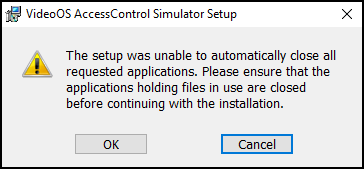

# Download the latest version

The XPA Simulator installation program is available from the Custom Development America's Azure DevOps ACM Server Pipeline. [Here](https://milestonecdus.visualstudio.com/CustomDevAmerica) is the link to the Azure DevOps site.

1. Select **Pipelines** from the directory.</br>
>   
2. Select the **ACMServer** pipeline from the list of recently run pipelines.
3. Click on the title of the most recent release run.</br>
>   
4. In the **Summary** tab of this run, click the published items.</br>
>   
5. Expand the **Installers** published artifact and click on the **VideoOS.AccessControlSimulator.msi** to begin the download.</br>
>   

## Exporting your configuration

!!! warning "Backup files are version locked!!!"
    Each time you upgrade the simulator it must be rebuilt, and customized from scratch!!! You cannot make a backup, upgrade, and import the configuration from the old version. 

    If the database version of the backup file being restored doesn't match the version of the database supported by the installed XPA Simulator the restore process will not take place and the following error message will appear.

    

It is possible to restore an existing configuration to the XPA Simulator. And, it is also possible to make a backup of an existing configuration. This can help to save and move a customized configuration if it is required to completely remove the XPA Simulator or destroy the host environment. However, it is only possible to restore a configuration backup for a simulator that supports the same database version as the installed application. 

!!! success "file location"
    Configuration files are stored in the following file location:

    ```C:\ProgramData\VideoOS\VideoOS.AccessControlSimulator\backups```

    After an export, copy the .sqlite file and move it to the new environment before import.

1. Click the **Backup** button on the **Home** tab of the web user interface.
2. The **System Backup** dialog window opens. Name the configuration file.
3. Click **Backup**.</br>
>   
4. Click the **Restore** button on the **Home tab** of the web UI.
5. Choose a configuration from the **Available Backups** list in the **System Restore** dialog window.
6. Click the **Restore** button.</br>
>   
7. The system always displays a warning notifying the user that all current data will be removed in the restore process. Click **Restore**.</br>
>   
***

## Installing the new version

1. Close the Web UI of the simulator.
2. Shutdown the XPA Simulator service and the XPA Service if they are running.
3. Go to the Programs and Features menu and uninstall the **VideoOS AccessControl Simulator** program.
4. Delete the **VideoOS.AccessControlSimulator** configuration folder, available here: ```C:\ProgramData\VideoOS\```
>   
5. [Download the new version.](../Up/index.md#download-the-latest-version)
6. Run the VideoOS.AccessControlSimulator.msi file. 
>   
7. Click **Next** on the welcome step of the installation wizard.
8. Click **Install** to begin the installation of the XPA Simulator program.
9. After the wizard completes the installation process click **Finish** to exit the wizard.
10. Verify that the XPA Simulator service tray icon is available on the server.
>   

??? question "Files in Use"
    If you see the Files in Use step, choose the **Close the applications and attempt to restart them** option, and click OK

    
        
    The above step warns that the XProtect Access Simulator application is still running and using the files that are being replaced. Restarting afterward is always a good idea. It is best to stop any XPA related service that is already running on the OS before starting the upgrade.

    If any services are still running, like the XPA Service, you can see the following warning.

    

    Stop the XPA Service.

    

    If you see the restart option again. Click OK.

    If you see the running service warning again, click OK.
