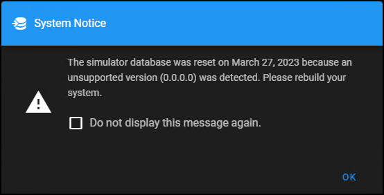

# XPA Simulator User Guide

This site contains all of the instructions and guidance required to make full use of the simulator application. You can jump right into the configuration and use of the system with these links, or by selecting a topic from the content directory on the left. The search field at the top of the page is enabled for all of the content on this site, and here are a couple of useful links if you need more help:

***

- [:fire:  __New Versions__ Find an updated simulator installer](https://milestonecdus.visualstudio.com/CustomDevAmerica/_build?definitionId=49).
- [:books:  __XPA Basics__ Learn more about XProtect Access](https://learn.milestonesys.com/courses/85976/).

***

??? question "How do I stop the error messages?"
    Each time you open the WebUI for the XPA Simulator an error message appears. This message contains the installation date, and reminds users that a new configuration is required before the simulator can be used. 

    Select the **Do not display this message again.** option to prevent this message from appearing each time this version of the simulator's WebUI is opened. 

    

For more info  :envelope: <mjt@milestone.us>

