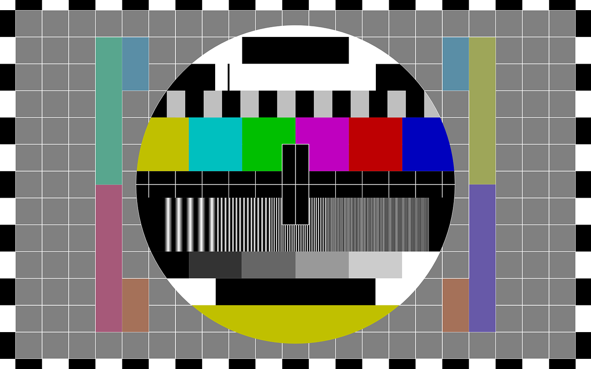

# Welcome to Glass Doc Test

For more info  :bootstrap-envelope: <mjt@milestone.us>

## Get started editing

* `.\\Run-MKDocsProject.ps1` - -port 8080

## Site structure

    mkdocs.yml    # The configuration file.
    docs/
        index.md  # The documentation homepage.
        ...       # Other markdown pages, images and other files.

---

- :bootstrap-magic:  __Install__ How to install Glass.
- :bootstrap-key:  __Features__ What Glass can do.
- :bootstrap-briefcase-fill:  __Tasks__ What you can do with Glass.
- :bootstrap-patch-question:  __Support__ Need help with Glass?

